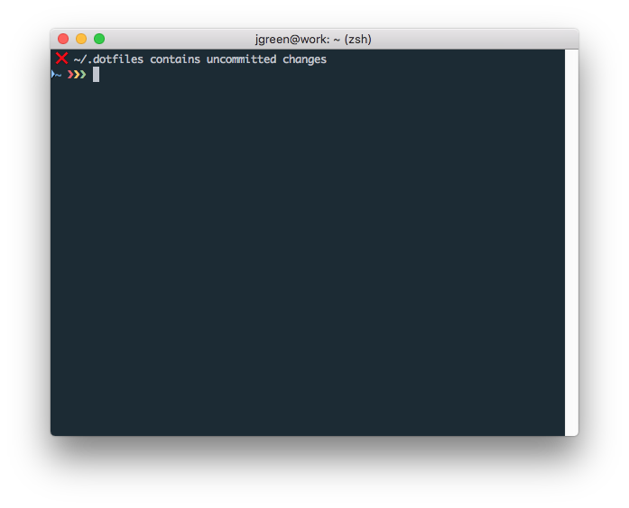

commitihag
==========

> swe. ***kommit ihåg*** -- eng. *remembered*

**commitihag** is a tiny command-line utility that helps you remember to commit your [dotfiles](https://dotfiles.github.io/).

Once per day when starting a new shell, commitihag will check `~/.dotfiles` for uncommitted changes.

If the state is dirty, commitihag will gently remind you to commit your changes:




Usage
-----

Just start a new shell.

commitihag will leave you a message you when you need to commit. At most once per day.


Install
-------

Run these commands to download and setup commitihag
```sh
# 1. Download script
curl https://raw.githubusercontent.com/jensgreen/commitihag/master/commitihag -o ~/bin/commitihag

# 2. Make executable
chmod +x ~/bin/commitihag

# 3. Run commitihag when starting a bash or zsh shell
echo "
# Remember to commit dotfiles
commitihag" | tee -a ~/.bashrc ~/.zshrc
```

Ignoring files
-------------

To ignore certain dotfiles, add `IGNORE=<globs>` to `~/.commitihagrc`. For example,
to ignore `vimrc` and VS Code's configs:

```
IGNORE=vimrc Library/Application\ Support/Code/User/*.json
```
